# Vektoryum — Gelişmiş Vektörleştirme Sistemi Proje Dokümantasyonu

> Bu doküman, genel "gelişmiş vektörleştirme sistemi" çerçeve dokümanının
> **bu depoya uyarlanmış** halidir. Çerçevedeki her kavram, Vektoryum'da hâlihazırda
> var olan modüllerle eşlenmiş; henüz var olmayanlar açıkça **[BACKLOG]** olarak
> işaretlenmiştir. Amaç kâğıt üstünde bir tasarı değil, mevcut kod tabanının
> doğru haritası + gerçekçi yol haritasıdır.

## 1. Yönetici Özeti

Çerçeve dokümanı hedef platform ve çıktı formatlarını "belirtilmemiş" varsayar;
Vektoryum'da her ikisi de **belirlidir**:

- **Platform:** Web uygulaması. Üretim ortamı Hugging Face Spaces (Docker,
  ücretsiz katman, 16 GB RAM). `main` dalına merge → `.github/workflows/hf-deploy.yml`
  → `ATESOGLU/Vektoryum` Space'ine otomatik deploy.
- **Çıktı formatları:** SVG (birincil) + PDF, EPS, DXF, PNG (ikincil).
  Format-bağımsız iç temsil → çoklu exporter ilkesi `engine/app/exporters.py`
  içinde zaten uygulanmıştır (`export_svg/pdf/eps/dxf/png/all`).

Depoda bugün **iki ayrı vektörleştirme motoru** yaşar; dokümantasyonun en kritik
tespiti budur:

| Motor | Konum | Teknoloji | Durum |
|---|---|---|---|
| **Kalite motoru** (Python) | `engine/app/` | çok-adaylı VTracer + algısal skorlama + geometrik iyileştirme | Bu depodaki asıl Ar-Ge birikimi; **şu an deploy edilmiyor** |
| **Hızlı tracer** (Node) | `server.ts` + `vectorizer.ts` | potrace (npm) + sharp; B/W trace veya renkli posterize | Kök `Dockerfile` ile **şu an HF'de canlı olan** motor |
| **v2 mikroservis iskeleti** | `services/` | FastAPI gateway + kuyruk + worker (RDP uygulanmış, diğer aşamalar hook) | İskelet; üretimde değil |

Çerçevenin temel felsefi tespiti Vektoryum deneyimiyle birebir doğrulanmıştır:
"kusursuz" vektörleştirme evrensel olarak mümkün değildir (aynı bitmap'i açıklayan
sonsuz eğri ailesi vardır — Potrace makalesinin ters-problem tespiti). Vektoryum'un
cevabı, çerçevenin önerdiğiyle aynıdır: tek sihirli dönüştürücü değil,
**çok aday üret → ölç → seç → iyileştir → tekrar ölç** hattı. Ölçüm korumalı
(measurement-gated) her adım, iyileştirme skoru düşürürse geri alınır.

## 2. Kapsam ve Tasarım İlkeleri — Vektoryum Karşılıkları

Çerçevenin üç kullanım sınıfı, `engine/app/analyzer.py`'nin otomatik mod
seçimiyle eşleşir:

| Çerçeve sınıfı | Analyzer modları | Ana strateji (mevcut kod) |
|---|---|---|
| Kapalı sınır (logo/ikon/siluet) | `geometric_logo`, `single_color`, `minimal_ai` | kontur + şekil oturtma (`shape_fitting.py`: daire/elips/dikdörtgen/roundrect/yıldız) + Bézier refit |
| İnce çizgi / strok topolojisi | `lineart` | kontur tabanlı izleme; iskelet/junction analizi **[BACKLOG — bkz. §8]** |
| Katmanlı renk alanları | `logo_color`, `photo_poster` | LAB k-means renk planlama (`preprocess.py`) + çok-adaylı VTracer + gradyan bant birleştirme (`gradient_vectorize.py`) |

Çerçevenin "scene graph + path graph + style graph" iç temsili Vektoryum'da
SVG path listesi + aday raporu (`candidate_report`) + katman istifi
(`shape_stacking`: `stacked` / `cutouts`, `cutouts.py` pyclipper ile boolean
dönüşüm) olarak somutlaşır. Exporter katmanı fitting/optimizasyon katmanından
ayrıdır; çerçevenin önerdiği risk azaltımı mevcuttur.

## 3. Boru Hattı — Gerçek Veri Akışı

Çerçevedeki soyut akışın bu depodaki gerçek karşılığı:

```mermaid
flowchart LR
    A[Raster girdi] --> B[analyzer.py<br/>mod secimi]
    B --> C[preprocess.py<br/>LAB k-means, supersample &lt;700px,<br/>izleme tavani VEKTORYUM_TRACE_CAP]
    C --> D[vector_engines.py<br/>cok-adayli VTracer uretimi<br/>paralel havuz]
    D --> E[geometry_cleanup.py + shape_fitting.py<br/>ilkel oturtma: daire/elips/dikdortgen/yildiz<br/>simetri tespiti]
    E --> F[scoring.py + fidelity.py<br/>SSIM + mean_delta_e + edge_f1<br/>resvg ile referans render]
    F --> G[pipeline.select_best<br/>editlenebilirlik tercihi<br/>path_count ekonomisi]
    G --> H[refine_best -> color_refit.py<br/>-> boundary_refit.py altpiksel<br/>-> edge_cleanup.py]
    H --> I[edge_cleanup.py<br/>Taubin duzgunlestirme +<br/>Schneider Bezier refit +<br/>ada yutma - hepsi tolerans kapili]
    I --> J[exporters.py<br/>SVG birincil]
    J --> K[PDF / EPS / DXF / PNG]
    J --> L[quality.py raporu<br/>production_ready / needs_review]
    L --> M[regression/fidelity_report.py<br/>surumler arasi gerileme kontrolu]
```



Modül sözlüğü (çerçeve kavramı → dosya):

| Çerçeve kavramı | Vektoryum dosyası |
|---|---|
| Giriş normalizasyonu / ön temizlik | `engine/app/preprocess.py` |
| Girdi rejimi sınıflandırma | `engine/app/analyzer.py` (+ opsiyonel HED derin kenar: `dl_segmentation.py`, `models/fetch_hed.py`) |
| Kontur çıkarma + polygonization | VTracer içinde (`vector_engines.py` sarmalayıcı) |
| Bézier/spline fitting | `edge_cleanup.py` (Schneider refit), `curve_refit.py`, `curve_fairing.py` (eklem teğet hizalama), `contour_smooth.py` |
| İmplicit/cebirsel ilkel oturtma | `shape_fitting.py` (Fitzgibbon tarzı elips dahil analitik şekiller) |
| Topoloji / self-intersection denetimi | `geometry_cleanup.py`; kapsamlı junction analizi **[BACKLOG]** |
| Nonlinear refinement + regularization | `pipeline.refine_best`, `boundary_refit.py`, `color_refit.py` |
| Çok-terimli kayıp / metrikler | `fidelity.py` + `scoring.py` (bkz. §6) |
| Format-bağımsız iç temsil + exporterlar | `exporters.py` |
| Test & benchmark rasterization | `fidelity.py` (resvg-py birincil, PyMuPDF fallback), `regression/` |

## 4. Literatür Ailelerinin Projedeki Karşılığı

| Aile | Çerçevedeki örnek | Vektoryum'daki durum |
|---|---|---|
| Klasik tracer | Potrace, AutoTrace, VTracer | **VTracer** Python çekirdeğinde (MIT, düşük lisans riski). **potrace (npm)** Node motorunda — GPL, bkz. §9 lisans uyarısı |
| Polygonization / RDP sadeleştirme | Ramer–Douglas–Peucker | `services/vectorizer_worker/vectorizer.py` içinde RDP uygulanmış; Python çekirdeğinde sadeleştirme tolerans kapılı Bézier refit ile yapılır |
| Bézier fitting | Schneider (Graphics Gems) | `edge_cleanup.py` — chord-length parametrizasyon + Newton–Raphson yeniden parametreleme, uç teğet korumalı |
| Skeletonization / medial axis | Zhang–Suen, Lee, Blum | **[BACKLOG]** — `lineart` modu bugün kontur tabanlı; iskelet+genişlik tahmini yok |
| İmplicit eğri (elips vb.) | Fitzgibbon direct LSQ | `shape_fitting.py` — daire/elips/dikdörtgen/roundrect/yıldız oturtma + simetrizasyon |
| Frame/PolyVector çizgi vektörleştirme | PolyVector Fields/Flow | **[BACKLOG]** — junction-yoğun çizimlerde bilinen zayıflık |
| Diferansiyellenebilir / nöral | DiffVG, LIVE, O&R, AdaVec | **[BACKLOG]** — çekirdek bugün klasik+ölçüm hattı; HED (opsiyonel) tek öğrenme-tabanlı bileşen |

Çerçevenin "fixed-N path bütçesini terk et, adaptif bütçe kullan" tavsiyesinin
Vektoryum karşılığı bugün kısmen mevcuttur: içerik-ölçekli renk bütçesi
(`preprocess.py` k-means K seçimi) ve `select_best` içindeki editlenebilirlik
tercihi (`_apply_editability_preference`: yakın sadakatte az `path_count` kazanır).
Tam adaptif path bütçesi (iteratif ekleme/azaltma) **[BACKLOG]**.

## 5. Matematiksel Çekirdek — Nerede Ne Uygulanıyor

Çerçevedeki genel optimizasyon biçimi:

```
min_V  D(R(V), I) + λ_g Ω_geom + λ_t Ω_topo + λ_s Ω_sparse
```

Vektoryum bunu tek global çözücüyle değil, **aşamalı ve ölçüm-korumalı** çözer
(her aşama kendi alt problemini çözer, toplam skor düşerse geri alınır):

- **D (raster sadakati):** `fidelity.py` → SSIM + ortalama ΔE (CIE) + kenar F1.
  Render referansı resvg (gradyan dahil tam destek); PyMuPDF yalnız fallback.
- **Ω_geom:** Taubin düzgünleştirme + Schneider refit toleransı
  (`tol ≈ max(1.5, 0.008·diag)`), eklemlerde teğet süreklilik (`curve_fairing.py`).
- **Ω_topo:** `geometry_cleanup.py` (dejenere/kendini kesen parçalar);
  kapsamlı junction cezası **[BACKLOG]**.
- **Ω_sparse:** aday seçiminde `path_count` ekonomisi; ada yutma (island absorb)
  küçük artık bölgeleri komşuya katarak ilkel sayısını düşürür.

Schneider fitting'in bilinen kırılganlıkları (parametreleme hatası, kötü başlangıç)
tolerans kapısıyla yönetilir: refit sonrası Hausdorff-benzeri sapma ölçülür,
eşik aşılırsa segment bölünür ya da orijinal korunur. Çerçevenin "parametrizasyon
gizli hiperparametredir" uyarısı bu kod için doğrudan geçerlidir; centripetal
parametrizasyon denemesi **[BACKLOG]**.

Sayısal stabilite pratikleri (çerçeve §"Sayısal Stabilite" karşılığı):

- Düşük çözünürlük: `preprocess.py` <700 px girdide alt-piksel süperörnekleme.
- Aşırı çözünürlük: izleme tavanı (`VEKTORYUM_TRACE_CAP`, varsayılan 2200 —
  ölçümle seçildi: 1600'de minik öğeler (ör. ® simgesi) çokgenleşiyor,
  3000'de süre 67 s → 110 s'ye çıkıyordu).
- Bellek gerçeği: küçük logo bile ~826 MB tepe kullanım → 512 MB ücretsiz
  sunucular (Render) elenmiş, HF Spaces (16 GB) seçilmiştir.
- Kırılgan iyileştirme adımlarının tümü ölçüm kapılıdır; skor düşerse geri alınır.

## 6. Metrikler ve Test Metodolojisi

Çerçevenin dört test katmanı depoda şöyle karşılanır:

| Katman | Çerçeve tanımı | Vektoryum karşılığı |
|---|---|---|
| 1. Birim test | basis/exporter/geometri | `engine/app/test_vector_engine.py`, `engine/test_vector_engine.py` |
| 2. Golden rasterization | çıktıyı yeniden rasterize et, hedefle kıyasla | `engine/test_visual_regression.py` + `engine/regression/` (fixtures, baselines, manifest.json) |
| 3. Özellik-temelli invariant | kapalı path, self-intersection yokluğu | `engine/test_artifact_quality.py`, `engine/test_synthetic_vector_quality.py`, `engine/regression/artifact_probe.py` |
| 4. Benchmark regresyonu | sürümler arası metrik gerilemesi | `engine/regression/fidelity_report.py` + `results/` |

Uygulanan / önerilen metrik seti:

| Metrik | Durum | Konum |
|---|---|---|
| SSIM | ✅ uygulanmış | `fidelity.py` |
| Ortalama ΔE (mean_delta_e) | ✅ uygulanmış | `fidelity.py` |
| Edge-F1 | ✅ uygulanmış | `fidelity.py` |
| Birleşik `fidelity_score` (0–100) | ✅ uygulanmış | `fidelity.py` → `scoring.py` |
| `geometry_score` + artefakt problar | ✅ uygulanmış | `quality.py`, `regression/artifact_probe.py` |
| Path/primitive sayısı | ✅ seçim kriteri | `pipeline.select_best` |
| Banding (gradyan bant) kontrolü | ✅ uygulanmış | `gradient_vectorize.py` |
| IoU | **[BACKLOG]** | teknik çizim rejimi için (çerçeve: Deep Technical Drawings metodolojisi) |
| Hausdorff / Mean Minimal Deviation | **[BACKLOG]** | sınır-sınır sapması; refit tolerans kapısı yerel bir yaklaşımını zaten kullanıyor |
| LPIPS | **[BACKLOG]** | algısal benzerlik; ek model bağımlılığı getirir, ücretsiz-katman bellek bütçesiyle tartılmalı |
| Junction doğruluğu | **[BACKLOG]** | iskelet/junction hattıyla birlikte gelmeli |

Kabul ölçütü (çerçevenin "kusursuzun pratik tanımı"): seçilen rasterizer altında
düşük rekonstrüksiyon kaybı + topolojik tutarlılık + editlenebilir primitive
sayısı + exporter semantiğinin korunması. Vektoryum'da bu, `quality.py`'nin
`production_ready` / `needs_review` durum raporuna ve regresyon eşiklerine
bağlanmıştır.

## 7. Benchmark Veri Kümeleri

Mevcut: `engine/regression/fixtures/` altında gerçek kullanıcı vakalarından
türetilmiş sabit girdiler (logo/amblem/illüstrasyon; büyük ikili dosyalar HF
push kısıtı nedeniyle deploy dışı tutulur, `hf-deploy.yml` exclude listesi).

Çerçevenin önerdiği harici kümelerden bu projeye uygun öncelik sırası:

1. **Noto Emoji / Fluent Emoji** — katmanlı renk rejimi; `logo_color` modunun
   adaptif renk bütçesini ölçmek için düşük maliyetli ilk aday.
2. **TU-Berlin / Quick, Draw!** — `lineart` modunun iskelet hattı geldiğinde.
3. **PFP / ABC / SESYD / DLD** — teknik çizim pipeline'ı **[BACKLOG]** açılırsa;
   bugünkü ürün kapsamının (logo/amblem web hizmeti) dışında.

## 8. Boşluk Analizi ve Araştırma Backlog'u (öncelik sırasıyla)

1. **Motor birleşmesi (ürün-kritik):** HF'de canlı olan Node motoru
   (potrace/posterize) kalite motorunun çıktısıyla kıyaslanamaz düzeydedir ve
   `%99 kalite hedefi` iddiasını taşıyamaz. Seçenekler: (a) FastAPI motorunu
   yeniden birincil backend yapmak, (b) Node'u API ağ geçidi olarak tutup
   vektörleştirmeyi Python worker'a devretmek (`services/` iskeleti tam bu
   amaçla var). Karar verilmeden diğer backlog kalemleri ikincildir.
2. **İskelet + junction kurtarma** (`lineart` rejimi): Zhang–Suen/Lee thinning +
   distance-transform genişlik tahmini; T/Y/X/star junction testleri.
3. **Adaptif path bütçesi:** iteratif path ekleme/azaltma + erken durdurma
   (O&R / AdaVec çizgisi); mevcut editlenebilirlik tercihini genelleştirir.
4. **IoU + Hausdorff/MMD metriklerinin** `fidelity.py`'ye eklenmesi ve
   regresyon eşiklerine bağlanması.
5. **Diferansiyellenebilir refinement (DiffVG):** Apache-2.0, deneysel opsiyonel
   modül olarak; CPU-yalnız HF ücretsiz katmanında süre bütçesi ölçülmeden
   üretime alınmamalı.
6. **Centripetal parametrizasyon** deney kolu (sivri köşeli konturlarda).

## 9. Lisans Durumu

> Hukuki tavsiye değildir; yayın/ticarileştirme öncesi doğrulanmalıdır.

| Bileşen | Katman | Lisans | Risk notu |
|---|---|---|---|
| vtracer | Python çekirdek | MIT | düşük |
| opencv-python-headless | Python | Apache-2.0 | düşük |
| numpy / scipy / Pillow | Python | BSD / HPND | düşük |
| ezdxf, svgpathtools, pyclipper | Python | MIT (Clipper çekirdeği Boost) | düşük |
| resvg-py | render (birincil) | MPL-2.0 | dosya-düzeyi copyleft; dinamik kullanım OK |
| **PyMuPDF** | render (fallback) | **AGPL-3.0** | ⚠️ ağ hizmetinde AGPL yükümlülüğü tartışması; resvg birincil olduğundan çıkarılabilir — backlog'a alınmalı |
| CairoSVG | PDF/EPS export | LGPL-3.0 | orta-düşük; saf-Python fallback (svglib/reportlab, BSD) zaten mevcut |
| huggingface_hub | kalıcılık (`store.py`) | Apache-2.0 | düşük |
| express, jimp, pdfkit, multer, bcryptjs | Node | MIT | düşük |
| sharp | Node | Apache-2.0 | düşük |
| **potrace (npm)** | Node motoru | **GPL-2.0** | ⚠️ üründe dağıtım/kapalı-kaynak planı varsa sorun; çerçevenin "GPL bileşeni çekirdeğe gömme" uyarısının birebir ihlali — motor birleşmesi (§8.1) bunu da çözer |

Çerçevenin stratejik önerisi bu tabloyla desteklenir: **ürün çekirdeği permisif
lisanslı Python hattıdır**; GPL'li Node-potrace hattı geçici köprü olarak
görülmelidir.

## 10. CI/CD ve Claude Code Entegrasyonu

Mevcut durum:

- `.github/workflows/hf-deploy.yml`: `main`'e push → tüm repo (regression ve
  node_modules hariç) HF Space köküne rsync + temiz `git init` force-push.
  Kök `Dockerfile` Node sunucusunu derler (`esbuild` → `dist/server.cjs`).
- PR'larda çalışan test CI'ı **yok** — çerçevenin birinci hattı **[BACKLOG]**:
  motor test koşucuları (`engine/test_*.py` — pytest değil, bağımsız script'ler)
  + regresyon smoke + `npm run build` içeren bir `ci.yml`.
- Claude Code proje sözleşmesi: kökteki `CLAUDE.md` (bu dokümanla birlikte
  eklendi). Hook/skill/subagent yapılandırması bilinçli olarak **eklenmedi**;
  var olmayan script'lere işaret eden `settings.json` oturumları bozar.
  İhtiyaç doğduğunda önce script, sonra kayıt eklenmelidir.
- `@claude` tetiklemeli PR review Action'ı isteğe bağlıdır; eklenmesi
  `ANTHROPIC_API_KEY` secret'ı gerektirir (ücretsiz-katman hedefiyle tartılmalı).

## 11. Yol Haritası — Uyarlanmış Faz Tablosu

Çerçevenin A–H fazlarının bu depodaki gerçek durumu:

| Faz (çerçeve) | İçerik | Durum |
|---|---|---|
| A — iskelet + test harness | repo, CI, scene graph | ✅ büyük ölçüde var (test katmanları §6); PR CI'ı eksik |
| B — klasik çekirdek | kontur + sadeleştirme + Bézier + SVG exporter | ✅ tamam (VTracer + refit + exporters) |
| C — teknik çizim hattı | skeleton/junction/line+quad | ❌ **[BACKLOG §8.2]** |
| D — refinement + PDF/DXF | robust loss, self-intersection, çoklu exporter | ✅ büyük ölçüde tamam (ölçüm-kapılı refinement + 5 format) |
| E — diferansiyellenebilir modül | DiffVG/LIVE benzeri katman | ❌ **[BACKLOG §8.5]** |
| F — benchmark otomasyonu | golden render, metric dashboard | 🟡 kısmi (regression + fidelity_report var; dashboard ve harici kümeler yok) |
| G — lisans temizliği + paketleme | ürünleştirme | 🟡 kısmi (bu doküman §9; PyMuPDF/potrace-npm kararları açık) |
| H — sürekli araştırma | topoloji, hız, yeni yöntemler | 🟡 backlog §8 |

**İlk teslimat eşiği (uyarlanmış):** logo/amblem rejiminde deterministik,
editlenebilir, `production_ready` SVG (✅ bugün sağlanıyor — Python motorunda);
katmanlı rejimde emoji-ölçeği rekonstrüksiyon (🟡 `logo_color` ile kısmen);
teknik çizim rejimi (❌ kapsam dışı/backlog). **En acil ürün kararı, bu kaliteyi
canlı siteye geri taşımaktır (§8.1).**
